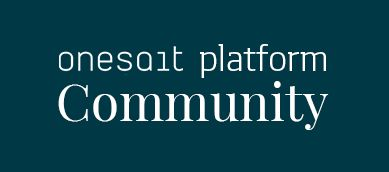
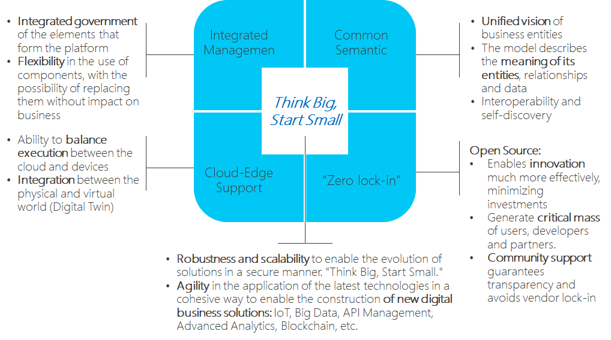
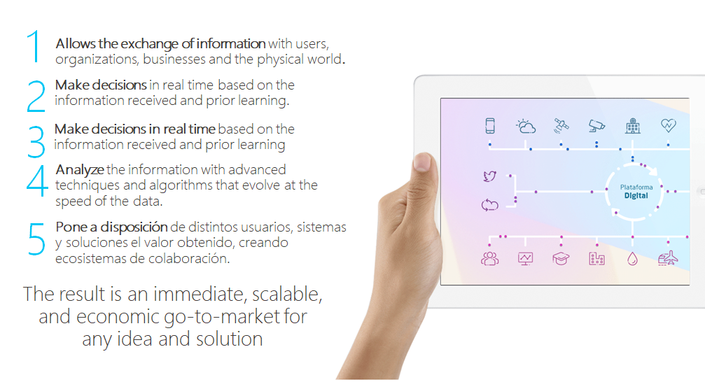
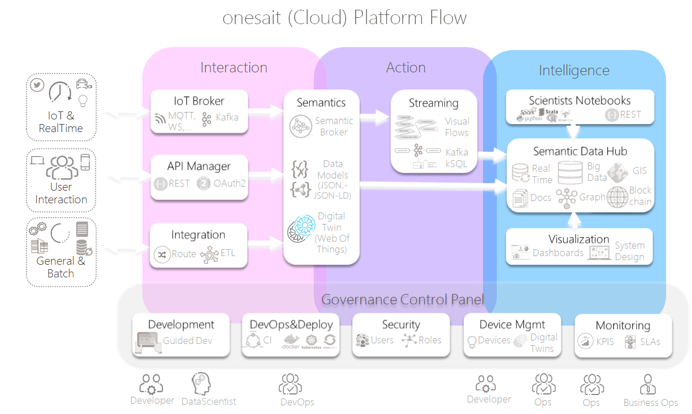

<p align="center">
  <a src='https://www.onesaitplatformrevolution.com/#/proposito/en'>
    
  </a>
</p>

## Why us?
We are sure that we have a unique offer in the market based on a combination of differential elements:
<p align="center">
    
</p>


[Read more](https://onesaitplatform.atlassian.net/wiki/spaces/OP/overview)

## What is?
**onesait Platform** is an multi-purpose, enterprise and open-source platform for building complete end-to-end solutions, connected applications, and smart products. 
The platform provides an open toolkit for the IoT/Smart product development that reduces associated cost, risks, and time-to-market.
The Platform is the technological base that capitalizes and extracts value from the flow of information between heterogeneous channels:
<p align="center">
    
</p>

More info in our [Vision](https://onesaitplatform.atlassian.net/wiki/spaces/OP/pages/393228/Vision)
 
## Roadmap

As we are working on a open source model, you can participate in our roadmap, besides this we have a roadmap for 2018 and 2019, you can view it here:
[2018-2019 Roadmap](https://onesaitplatform.atlassian.net/wiki/spaces/OP/pages/32979/Roadmap+onesait+Platform+Cloud)

 
## Technology

onesait Cloud Platform is built mainly on Java technology, developed as a  Spring-powered microservices architecture and deploy with Docker and Kubernetes.

This diagram show you a firt glance of the Platform in the present moment:
<p align="center">
    
</p>

You can continue on [Architecture Overview](https://onesaitplatform.atlassian.net/wiki/spaces/OP/pages/360455/Architecture+Guides)

## Getting started with the platform

In our [Confluence Developer Portal](https://onesaitplatform.atlassian.net/wiki/spaces/OP/pages/45842643/Platform+Guides) we have a complete set of guides and tutorials.

For the quick start you can start with one of these guides:

* [Getting Started on onesait Platform CloudLab](https://onesaitplatform.atlassian.net/wiki/spaces/OP/pages/33179/Getting+Started)
* [Compile and Execute onesait Platform in your local Development Environment](https://onesaitplatform.atlassian.net/wiki/spaces/OP/pages/7897242/Develop+How+to+execute+the+platform+in+local+example+for+Windows)
* [Execute onesait Platform with Docker](https://onesaitplatform.atlassian.net/wiki/spaces/OP/pages/4194325/Deployment+How+to+execute+the+platform+with+Docker)


## Getting help and reporting issues

Having trouble with onesait Platform? We’d like to help!

* Check the reference documentation, especially the [Platform Guides](https://onesaitplatform.atlassian.net/wiki/spaces/OP/pages/45842643/Platform+Guides), they provide solutions to the most common questions.
* Learn more about the platform in our [Confluence Developer Portal]( https://onesaitplatform.online)
* Report bugs of the platform at [onesait Platform GitHub](https://github.com/onesaitplatform)

### Reporting Issues
onesaitPlatform uses Gitlab/Github’s integrated issue tracking system to record bugs and feature requests. If you want to raise an issue, please follow the recommendations below:
- Before you log a bug, please search the issue tracker to see if someone has already reported the problem.
- If the issue doesn’t already exist, create a new issue.
- Please provide as much information as possible with the issue report, we like to know the version of onesait Platform that you are using, as well as your Operating System and JVM version.
- If you need to paste code, or include a stack trace use Markdown ``` escapes before and after your text.
- If possible try to create a test-case or project that replicates the issue. You can submit sample projects as pull-requests against the onesait-cloud-platform-issues Gitlab project. Use the issue number for the name of your project.

## Project Structure

The project follows this skeleton:
*  [devops](devops/) with information like Dockerfiles, docker-compose.yml, scripts to generate images, jenkins pipelines,...
*  [sources](sources/) all the sources of the platform.
*  [tools](tools/) files needed to execute some tools included in the platform.

## How to contribute

To contribute to onesait Platform, please visit [How to contribute](https://onesaitplatform.atlassian.net/wiki/spaces/OP/pages/9142309/Contribution+Guide) information.

## License

onesait Platform is Open Source software released under the [Apache Software License 2.0](http://www.apache.org/licenses/LICENSE-2.0).

See [`LICENSE`](LICENSE) and [`copyright.txt`](copyright.txt) for details.
 
